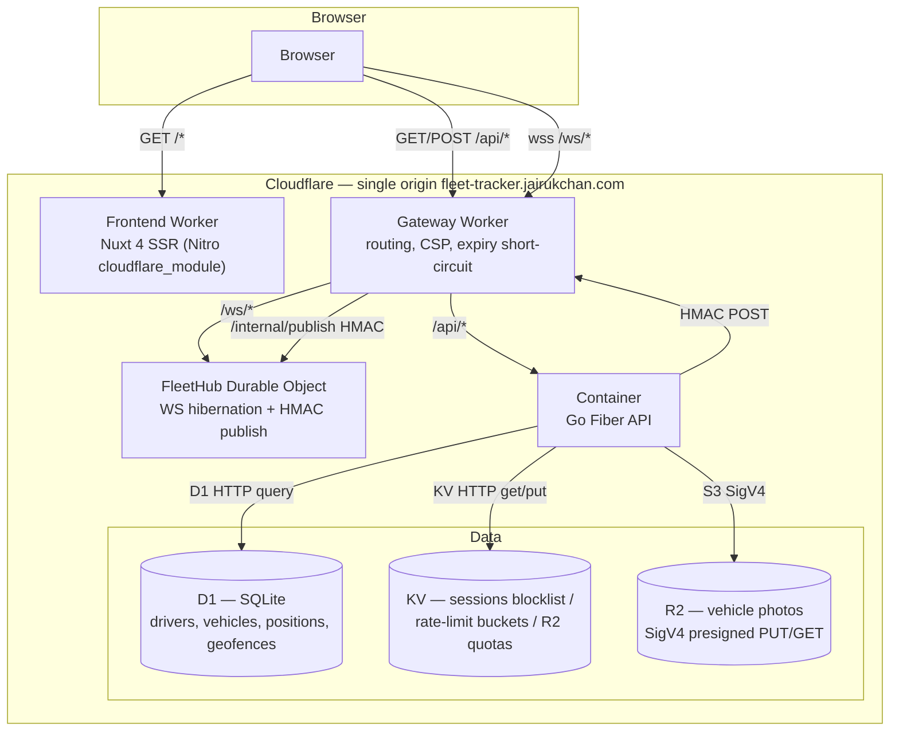
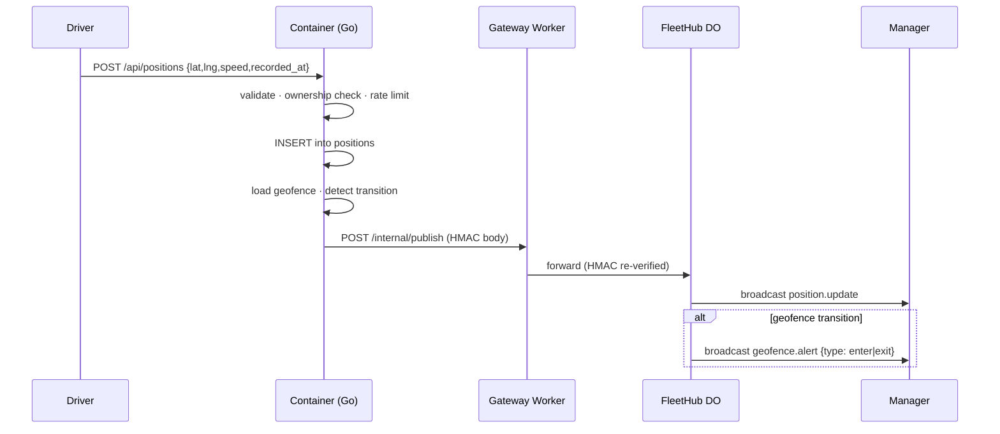

# Architecture

A companion to the [README](README.md). The README is the landing page; this document is the design narrative — why the demo is shaped the way it is, where the production-quality Go signal lives, what the deliberate trade-offs are, and how to revive the demo after the 2026-05-31 cut-off.

---

## Goals and non-goals

**Goals**

- Demonstrate Go production-quality code in a clean-architecture Fiber service: middleware stack, dependency direction, table-driven tests, graceful shutdown, structured logging with request-scoped context.
- Prove same-origin browser security primitives: HttpOnly + SameSite=Lax cookies, double-submit CSRF, tight CSP, no CORS preflight surface.
- Run end-to-end on the Cloudflare ecosystem — Workers, Containers, D1, KV, R2, Durable Objects — without escaping to a non-CF dependency.
- Bound the total demo cost under $5 by combining a global per-IP rate limit (umbrella) with a hard demo expiration (deliberate-friction revival).
- Ship four bonus features that exercise different parts of the stack: driver simulator CLI, geofencing alerts over WebSocket, history replay, R2 photo upload with per-user quota.

**Non-goals**

- Mobile clients. The driver page is a web form with a `navigator.geolocation` convenience button; a real fleet would have a native client.
- Payment, multi-tenancy, advanced RBAC. The role model is two values: `driver` and `manager`.
- Kafka or RabbitMQ. The fan-out path is a Durable Object — see [Trade-offs § DO over Redis pub/sub](#do-over-redis-pubsub).
- 100 % test coverage. Tests demonstrate the table-driven pattern, the integration shape (`fiber.App.Test`), and the in-memory SQL double behind the `Executor` interface — they do not exhaustively cover every branch.
- Horizontal scale beyond one Container instance. The Container is fronted by the gateway Worker, which is horizontally scaled by Cloudflare automatically; the Go API itself runs as a single instance because that is enough for a demo and because horizontal scale would force the WebSocket hub into a Durable Object regardless — which it already is.

---

## System diagram



The diagram intentionally repeats the README's view at higher fidelity. The README is for first contact; this one is for the reader who wants to know which arrow carries which auth scheme.

---

## Routing model

The single-origin path-based dispatch is the cornerstone of the security model.

| Pattern | Worker | Destination | Notes |
|---------|--------|-------------|-------|
| `fleet-tracker.jairukchan.com/api/*` | Gateway | Container (Go Fiber) | HTTP/1.1 + HTTP/2 |
| `fleet-tracker.jairukchan.com/ws/*` | Gateway | FleetHub Durable Object | WebSocket upgrade |
| `fleet-tracker.jairukchan.com/internal/publish` | Gateway | FleetHub Durable Object | HMAC-signed, never exposed to browsers (CSP `connect-src` excludes it; gateway rejects requests without the shared secret) |
| `fleet-tracker.jairukchan.com/*` | Frontend Worker | Nuxt SSR | Catch-all, lowest specificity |

Cloudflare resolves Worker routes by specificity, so the same hostname can dispatch to two Workers cleanly. Dev mode uses `wrangler dev` to emulate the same dispatch at `http://localhost:8787`, which keeps the same-origin assumptions truthful in development.

**Why same-origin matters here:**

- **`SameSite=Lax` cookies, not `SameSite=None`.** The browser refuses to send a `SameSite=Lax` cookie on a cross-site `POST` initiated from a third-party page, so CSRF is blocked at the browser layer for top-level navigations. We keep double-submit CSRF as defence-in-depth and as a deliberate JD-aligned signal.
- **No CORS preflight on same-origin fetches.** That means the browser sends the auth cookie immediately on first request; no extra round-trip; no `Access-Control-Allow-Credentials` permission slip to mis-configure.
- **The WebSocket handshake sends cookies automatically.** Authenticating `wss://fleet-tracker.jairukchan.com/ws/fleet` is a normal HTTP upgrade with the JWT cookie present in headers — no `?token=` query string, no client-side token wrangling.
- **CSP can be tight.** The deployed policy is `default-src 'self'; script-src 'self' https://maps.googleapis.com; connect-src 'self' wss://fleet-tracker.jairukchan.com https://maps.googleapis.com; img-src 'self' data: https://maps.gstatic.com https://*.googleapis.com; frame-ancestors 'none'`. The gateway Worker injects this header on every HTML response from the frontend Worker so the policy lives next to routing, not buried in a Nuxt plugin.

---

## Backend layering

The Go API follows a strict clean-architecture inward dependency direction. Outer layers know about inner layers; inner layers know nothing about outer layers.

```text
cmd/api/                       composition root
  ├── main.go                  signal handling, lifecycle, log config
  └── bootstrap.go             builds CF clients → repos → usecases → handlers → app

internal/
  ├── handler/                 Fiber handlers — HTTP shell only
  ├── middleware/              cross-cutting: auth, csrf, ratelimit, expiry, request-id, logger
  ├── usecase/                 business logic, validation, ownership checks
  ├── domain/                  entities + sentinel errors — no I/O imports
  ├── repository/d1/           SQL access via the Executor interface
  └── publisher/               HMAC POST adapter for the gateway publish endpoint

pkg/
  ├── cfclient/                typed HTTP clients for D1 / KV / R2 / DO — leaf nodes
  ├── geo/                     pure functions: Haversine + circular geofence
  ├── hash/                    argon2id wrapper around golang.org/x/crypto/argon2
  └── jwt/                     HS256 signer + verifier with WithValidMethods pin
```

Two design choices in this layout are worth pointing out:

**The `Executor` interface lives at the consumer, not the provider.** The migrator and every D1 repository depend on a narrow `Executor` interface (`Exec`, `QueryRow`, `Query`) declared in `internal/repository/d1/migrator.go`. The real implementation lives in `pkg/cfclient` and talks to the D1 HTTP endpoint; the test double in `migrator_test.go` is a thin adapter around `mattn/go-sqlite3`. Both satisfy the same interface — and the interface is declared at the consumer site so swapping the backend never touches the consumer. This is the Go-idiomatic answer to the same problem dependency injection solves in other languages.

**The composition root is the only place that knows the full dependency graph.** `cmd/api/bootstrap.go` is the only file that imports every layer. Handlers, usecases, and repositories know about their direct collaborators by interface and nothing else. The seed CLI (`cmd/seed/main.go`) reuses the same auth and vehicle usecases — so anything the production validation enforces, the seed enforces too. This keeps the demo seed honest without separate validation code.

---

## Data model

D1 uses SQLite; the schema below is adapted from the original Postgres design with SQLite-appropriate types. Timestamps are `INTEGER` unix-ms (consistent with `time.UnixMilli` in Go); IDs are UUID v7 generated app-side (lexicographically sortable by creation time, which matters for paginating positions in time order).

```sql
CREATE TABLE drivers (
    id TEXT PRIMARY KEY,
    email TEXT UNIQUE NOT NULL,
    password_hash TEXT NOT NULL,
    name TEXT NOT NULL,
    role TEXT NOT NULL CHECK (role IN ('driver', 'manager')),
    created_at INTEGER NOT NULL,
    updated_at INTEGER NOT NULL
) STRICT;

CREATE TABLE vehicles (
    id TEXT PRIMARY KEY,
    plate_number TEXT UNIQUE NOT NULL,
    model TEXT,
    driver_id TEXT REFERENCES drivers(id) ON DELETE SET NULL,
    created_at INTEGER NOT NULL,
    updated_at INTEGER NOT NULL
) STRICT;

CREATE TABLE positions (
    id INTEGER PRIMARY KEY AUTOINCREMENT,
    vehicle_id TEXT NOT NULL REFERENCES vehicles(id) ON DELETE CASCADE,
    lat REAL NOT NULL,
    lng REAL NOT NULL,
    speed_kmh REAL,
    recorded_at INTEGER NOT NULL,
    created_at INTEGER NOT NULL
);
CREATE INDEX idx_positions_vehicle_time ON positions(vehicle_id, recorded_at DESC);

CREATE TABLE geofences (
    id TEXT PRIMARY KEY,
    vehicle_id TEXT NOT NULL REFERENCES vehicles(id) ON DELETE CASCADE,
    center_lat REAL NOT NULL,
    center_lng REAL NOT NULL,
    radius_m INTEGER NOT NULL,
    created_at INTEGER NOT NULL
) STRICT;

CREATE TABLE schema_migrations (
    version TEXT PRIMARY KEY,
    applied_at INTEGER NOT NULL
) STRICT;
```

**Notes on the choices:**

- `STRICT` mode is on for every table except `positions`. `positions.id` uses `INTEGER PRIMARY KEY AUTOINCREMENT`, which is a `ROWID` alias with well-defined SQLite semantics; mixing it with `STRICT` adds friction without payoff.
- `ON DELETE SET NULL` on `vehicles.driver_id` lets a driver be deleted without orphaning vehicle records — managers can reassign.
- `ON DELETE CASCADE` on `positions.vehicle_id` and `geofences.vehicle_id` keeps the history aligned with the parent vehicle's lifetime.
- The `idx_positions_vehicle_time` composite index is `(vehicle_id, recorded_at DESC)` so the `GET /api/vehicles/:id/positions?from=&to=&limit=` range query is a single index seek even at scale.
- Migrations are embedded into the Go binary via `//go:embed`. The migrator applies pending versions on startup and records them in `schema_migrations` so re-runs are no-ops.

---

## Auth and security

Cookies, hashing, and rate limits are layered. None of them on their own is enough; together they cover the realistic threat model for a public demo.

**Password hashing — argon2id.** Parameters follow RFC 9106 first-recommended option: memory `m = 64 MB`, time `t = 3`, parallelism `p = 2`. The output is a PHC-encoded string stored verbatim in `drivers.password_hash`, so future parameter changes can coexist with old hashes — the verifier parses the encoded params at check time.

**JWT — HS256 with algorithm pinning.** `pkg/jwt` issues short-lived tokens (1 h access TTL) with claims `{ iss: "mini-fleet-tracker", sub, role, jti, iat, exp }`. The verifier uses `jwt.WithValidMethods([]string{jwt.SigningMethodHS256.Alg()})` — this rejects any token whose header advertises `alg: none` or `alg: RS256`, closing the classic algorithm-substitution attack at the library level. The HS256 secret is the same value shared between the Go API, the gateway Worker, and the Durable Object; rotation is a one-shot `wrangler secret put` across all three.

**JTI blocklist on logout.** Every issued token has a unique `jti` (UUID v4). On `POST /api/auth/logout` we write `bl:{jti} = 1` into KV with TTL set to the remaining token lifetime. The auth middleware checks every request against this blocklist. Logout therefore actually invalidates the cookie even though JWTs are stateless — and the blocklist self-cleans because KV honours the TTL.

**Cookies.** `auth_token` is `HttpOnly; Secure; SameSite=Lax; Path=/`. `csrf_token` is `Secure; SameSite=Lax; Path=/` (deliberately not HttpOnly — JavaScript needs to read it to set the `X-CSRF-Token` header). In local dev the `Secure` flag is gated off when `APP_ENV=development` so `http://localhost:3000` works without a self-signed certificate.

**CSRF — double-submit cookie.** Primary protection comes from `SameSite=Lax` blocking cross-site `POST` at the browser layer. The double-submit token is defence-in-depth and a deliberate signal to the JD review — the middleware runs on every `POST`, `PATCH`, `PUT`, `DELETE` and compares the header to the cookie.

**Rate limits — global umbrella + per-route.** Two layers, both KV-backed token buckets:

| Scope | Limit | Storage key | Behaviour |
|-------|-------|-------------|-----------|
| Per-IP global | 600 req/min, 10 000 req/day | `rl-global:{ip}:{min}`, `rl-global:{ip}:{day}` | 429 with `Retry-After` |
| Per-IP WS upgrade | 3 upgrades/min | `rl-ws:{ip}` | Upgrade rejected with 429 |
| Per-IP healthz | 60 req/min | `rl-health:{ip}` | 429 (prevents healthz spam from inflating quotas) |
| Per-IP login | 5 attempts/5 min | `rl:{ip}:login` | 429 + login form throttle |
| Per-driver position | 60 writes/min | `rl:{driver}:positions` | 429 |
| Per-IP photo presign | 10 req/min | `rl:{ip}:presign` | 429 (before quota check) |

The token-bucket implementation lives in `internal/middleware/ratelimit.go`; the global umbrella is in `ratelimit_global.go` and is mounted before any route handler.

**Enumeration-resistant login.** The auth usecase computes a precomputed dummy argon2id hash at init time and runs `VerifyPassword` against it on the missing-user path, so the wall-clock cost of `wrong password for an existing user` and `unknown email` is statistically indistinguishable. Without this, a timing oracle would let an attacker enumerate valid emails. See `dummyHash` in `internal/usecase/auth_usecase.go`.

**R2 abuse controls.** Per-user quota 3 uploads/day/vehicle (KV counter keyed `quota:{user}:{date}`, TTL 24 h), presigned PUT TTL 5 min, `Content-Length-Range` SigV4 condition for a 5 MB cap, and the per-IP presign rate limit above. Combined, a compromised manager cookie cannot torch the R2 bill.

**Threat model summary.**

| Threat | Control |
|--------|---------|
| Token theft via XSS | HttpOnly cookie + tight CSP |
| CSRF on mutating routes | SameSite=Lax (primary) + double-submit (defence-in-depth) |
| WS hijack | Origin check at DO upgrade + JWT verify + cookie required on handshake |
| Brute-force login | KV token bucket 5/5 min + enumeration-resistant timing |
| Position spam | KV token bucket 60/min per driver |
| R2 mass upload | per-user quota + presigned TTL + size cap + per-IP presign limit |
| Cost-spike scraping | Global per-IP 600/min + 10 K/day umbrella |
| Indefinite Container cost | Hard demo expiration (see [Cost protection](#cost-protection)) |
| Algorithm substitution on JWT | `WithValidMethods([]{HS256})` |
| Replay of revoked token | JTI blocklist in KV |
| SQL injection | Parameterised queries via D1 HTTP only — no string concat |
| Input mistrust | `zod` (frontend) + `validator/v10` (backend) |

---

## Live tracking

The fan-out path from a driver's GPS report to a manager's live map.



Three things make this path defensible:

1. The publish is **best-effort and non-blocking**. If the gateway is down or the DO rejects, the position is still saved to D1; the publish failure is logged. A failed publish never returns a 5xx to the driver.
2. The gateway-to-DO hop **re-verifies HMAC**. The shared internal-publish secret is held by the Container and the gateway only; the DO trusts neither, so a forged HMAC at the gateway boundary cannot fool the DO.
3. **Geofence transition detection is in the usecase**, not the DO. The transition fires only on edge crossings (inside → outside or outside → inside), so a stream of positions inside a fence does not spam `geofence.alert` events. The state is "previous position relative to fence", carried in-memory on the Container; this is approximate but correct enough for a demo.

The `position_usecase` uses the functional-options pattern (`NewPositionUsecase(..., WithGeofences(repo))`) so the geofence dependency is opt-in. Tests that don't care about geofences instantiate without the option; the geofence test path instantiates with it.

---

## Cost protection

Two layers. Layer 1 prevents abuse from inflating the bill during the demo window; layer 2 caps the demo window itself.

**Layer 1 — Global per-IP umbrella.** Already documented in [Auth and security](#auth-and-security). The 600 req/min + 10 K req/day caps mean a single attacker would need many IPs to push the bill, and at that point the per-route caps kick in too.

**Layer 2 — Hard demo expiration.** A single constant — `2026-05-31T23:59:59+07:00` — is baked into three places:

```go
// backend/cmd/api/main.go
const DemoExpiresAt = "2026-05-31T23:59:59+07:00"
```

```typescript
// workers/gateway/src/index.ts
export const DEMO_EXPIRES_AT = '2026-05-31T23:59:59+07:00'

// workers/fleet-hub/src/fleet-hub.ts
export const DEMO_EXPIRES_AT = '2026-05-31T23:59:59+07:00'
```

After the cut-off:

- The Go API's `expiry` middleware returns `410 Gone` for every route except `/healthz`, with body `{ "code": "demo_expired", "repo_url": "https://github.com/ilGentEAcutoO/mini-fleet-tracker", "expired_at": "..." }`. `/healthz` continues to return `200` with `{ "status": "expired", "commit": "..." }` so monitoring stays useful.
- The gateway Worker short-circuits `/api/*` and `/ws/*` to `410` **before forwarding to the Container** — this is the actual cost saving, because it stops Container wake-ups from upstream traffic.
- The FleetHub Durable Object rejects new WebSocket upgrades with `410`.
- The Nuxt frontend's `useApi` composable detects `410` on any API call and redirects to `/expired`, a static page with the repo link and a brief explanation.

**Why `const` and not an environment variable?** A `wrangler secret put` could flip an environment-variable kill-switch in seconds. We want the opposite — the cut-off has to be source-edited, the binary rebuilt, both Workers redeployed, and the Container manually scaled back up. Five deliberate steps. That's not a paranoid choice; it's the only way to make accidental revival impossible from a misclick during the application interview season.

On the morning of 2026-06-01, after the cut-off has fired, the operator runs `wrangler deploy --container instances=0` to scale the Container to zero. Workers stay live on free tier and continue serving `/expired`. Total spend for the demo window is capped under $5; ongoing spend after the cut-off is $0.

---

## Demo revival workflow

If the demo needs to come back — for a second-round interview, say — these are the five steps:

1. Edit `const DemoExpiresAt` in `backend/cmd/api/main.go` to a new RFC 3339 timestamp.
2. Edit `const DEMO_EXPIRES_AT` in `workers/gateway/src/index.ts`.
3. Edit `const DEMO_EXPIRES_AT` in `workers/fleet-hub/src/fleet-hub.ts`.
4. From `workers/`, run `wrangler deploy` to ship both Workers with the new cut-off.
5. From `backend/`, run `make build && wrangler deploy --container instances=1` to rebuild the binary, push the image, and scale the Container back to one instance.

After step 5 the demo is live again at the same URL. The five steps cannot be done from any Cloudflare dashboard alone — there is no toggle, no setting, no secret to flip. That's the friction the architecture wants.

---

## Trade-offs

The interesting choices and what they cost.

### Cloudflare Containers cost vs free-tier alternatives

Cloudflare Containers is not on the free tier. A 256 MB container running 24/7 lands somewhere between $3 and $8 a month. The chosen mitigation is the hard expiration above — total spend for the demo window is capped under $5. The alternative would have been deploying the Go binary to Render's free tier (cold-start delays) or Fly.io's free allowance (different infra story). The Cloudflare-end-to-end narrative is the point of the demo, so paying for the Container is the deliberate cost.

### D1 (SQLite over HTTP) over Postgres + `pgx`

This is the most honest trade-off in the stack. The original spec calls for Postgres + `pgx/v5`, which is what a real fleet would use. D1 was chosen so the demo could stay on Cloudflare end-to-end. The cost is that the data layer talks HTTP, not a typed binary protocol — so the Go side reads slightly less idiomatic than a `pgx` pgx-prepared statement would.

The compensation is the layering above. The `Executor` interface is consumer-defined and narrow (`Exec`, `QueryRow`, `Query`), the repository code uses parameterised queries throughout, and the test double is `mattn/go-sqlite3` exercising real SQL. Swapping to `pgx` would be: replace `pkg/cfclient.D1` with a `pgx`-backed `Executor` adapter; nothing in `internal/repository/d1` changes. Same-day change.

If the JD review wants to see `pgx`, the cleanest answer is "the seams are here; let me show you the patch on a branch."

### Durable Object over Redis pub/sub

The spec offered Redis pub/sub as the lightweight option. Cloudflare equivalent: a Durable Object with the WebSocket Hibernation API. The DO wins on three points:

- **Hibernation = scale-to-zero between bursts.** Redis would idle a connection pool; the DO releases its WebSockets to hibernation and pays $0 between events.
- **CF-idiomatic.** The point of this demo is the CF stack story; introducing Redis would break it.
- **JWT verification at the upgrade boundary.** Same shared secret as the Go API, no out-of-band token plumbing.

The cost is a TypeScript path inside an otherwise Go-heavy backend story. The mitigation: the gateway Worker is ~250 lines and the Durable Object is ~400 lines. Both are small enough to read in one sitting. They are not the centre of the production code signal — the Go service is.

### Nuxt 4 over plain Vue 3

A plain Vue 3 SPA would have been simpler. The reasons to use Nuxt 4 anyway:

- **SSR for the public landing.** The marketing page renders to HTML for the demo URL share — no white-flash, no client-side hydration delay on first paint.
- **File-based routing and auto-imports.** Faster scaffolding; less boilerplate in `app/pages/`.
- **`cloudflare_module` Nitro preset.** First-class Worker deploy with no Pages dependency. The spec was explicit: Workers, not Pages.

The cost is a slightly more complex frontend toolchain. The mitigation: the Nuxt config is ~50 lines, the deploy is one `pnpm build && wrangler deploy`, and the runtime story is identical to plain Vue from an end-user perspective.

---

## Testing strategy

Layered, demonstrating patterns rather than chasing coverage numbers.

**Unit — table-driven Go.** `_test.go` files sit next to the code they test. Examples:

- `pkg/geo/haversine_test.go` — known city pairs within tolerance; zero distance; boundary inclusivity for `IsInsideCircle`.
- `pkg/jwt/jwt_test.go` — tampered signature, expired token, valid token claims, `alg=none` rejection.
- `internal/usecase/auth_usecase_test.go` — duplicate-email register, wrong-password login, login success claims, logout blocklists JTI.
- `internal/usecase/position_usecase_test.go` — lat/lng range validation, driver-ownership check, rate-limit propagation, geofence transition detection.

**Integration — Fiber `app.Test()` against in-memory repos.** Handler-level tests build the full middleware stack against fake repos so the cookie + CSRF + rate-limit + auth chain runs unmodified. `internal/handler/auth_handler_test.go` is the canonical example.

**Repository against real SQL.** The `Executor` test double is `mattn/go-sqlite3` running in-memory. SQL syntax is parsed and executed by a real SQLite engine — the migrator, every repository CRUD, and the indexes are exercised end-to-end without any HTTP layer. See `internal/repository/d1/migrator_test.go`.

**Workers tests via `vitest-pool-workers`.** Runs the gateway and the Durable Object inside the workerd runtime so the WebSocket hibernation, the DO storage, and the route matching are exercised against real CF-style primitives, not mocks.

**No E2E in CI.** The cost of running Playwright against the live demo for every push would not pay back for a portfolio piece. The driver simulator CLI (`cmd/sim`) plus the manager dashboard is the manual demo recording path.

---

## Operational concerns

**Graceful shutdown.** `main.go` listens on SIGINT/SIGTERM, then calls `app.ShutdownWithContext(ctx)` with a 10 s deadline. In-flight requests complete; new connections are refused. The listener goroutine reports errors on a channel so a `Listen` failure during boot is not silent.

**Healthz with dependency pings.** `GET /healthz` runs `SELECT 1` against D1, performs a known-key `Get` against KV, and returns `{ "db": "ok", "kv": "ok", "commit": "<sha>", "demo_expires_at": "..." }`. A failing dependency drops the response to 503 with the failing key flagged. The endpoint is rate-limited at 60 req/min/IP so it does not become an amplification surface.

**Structured logging with request-scoped context.** `zerolog` is initialised in `configureLogger` (console for dev, JSON for production). The `Logger` middleware seeds a per-request `X-Request-Id` (generated or accepted from upstream) and stuffs the request-scoped logger into `c.UserContext()`. Every downstream log line carries `req_id`, `method`, `path`, `status`, `latency_ms` automatically.

**Container hygiene.** Multi-stage Dockerfile: `golang:1.23-alpine` build → `gcr.io/distroless/static-debian12` runtime. The runtime image carries no shell, no package manager, no curl. The binary runs as `nonroot` UID 65532. Image size lands around 18 MB.

**Build metadata.** `gitCommit` is stamped at build time via `-ldflags "-X main.gitCommit=$(git rev-parse --short HEAD)"` and surfaced in `/healthz`. The Makefile target wires it automatically.

---

## Where the Go signal lives

For a reviewer who wants to spot-check the Go-production claim, these are the files that carry the most signal:

- **`backend/cmd/api/main.go`** — the graceful-shutdown pattern, signal handling, dependency-driven boot. Under 140 lines and reads top-to-bottom.
- **`backend/cmd/api/bootstrap.go`** — the composition root. The only place that knows the full dependency graph; every other layer takes its collaborators by interface.
- **`backend/internal/repository/d1/migrator.go`** — the consumer-defined `Executor` interface, embedded migrations, idempotent apply. The interface declaration sits where the consumer is, not where the implementation is — that's the Go-idiomatic seam.
- **`backend/pkg/jwt/jwt.go`** — HS256 with `WithValidMethods` algorithm pinning; `Issuer` constant for cross-layer trust anchor; `Claims` composed from `jwt.RegisteredClaims`.
- **`backend/internal/usecase/auth_usecase.go`** — the dummy-hash enumeration-resistance pattern. `dummyHash` is computed once at init, reused on the missing-user path so login timing is independent of email existence.
- **`backend/internal/usecase/position_usecase.go`** — the functional-options pattern (`WithGeofences`), the publish best-effort pattern, the geofence transition detection.
- **`backend/internal/middleware/ratelimit_global.go`** — the KV-backed token-bucket umbrella with both per-minute and per-day caps; rolls over correctly at UTC midnight.
- **`backend/internal/middleware/expiry.go`** — the demo-expiration short-circuit; healthz exception handled explicitly.
- **`backend/Makefile`** — `help`, `dev`, `build`, `test`, `lint`, `sim`, `seed`, `docker-build`. Conventional targets, no surprises.

The rest of the codebase is unremarkable on purpose. Production Go is supposed to look boring; the value is in the seams, the error paths, and the things that aren't there (no panics, no globals beyond config, no unbounded goroutines).

---

## Further reading

- [README.md](README.md) — landing page, API spec, quick start
- The commit graph: `git log --oneline` shows the implementation arc across the four phases — auth → CRUD + live → bonuses → deploy + docs
