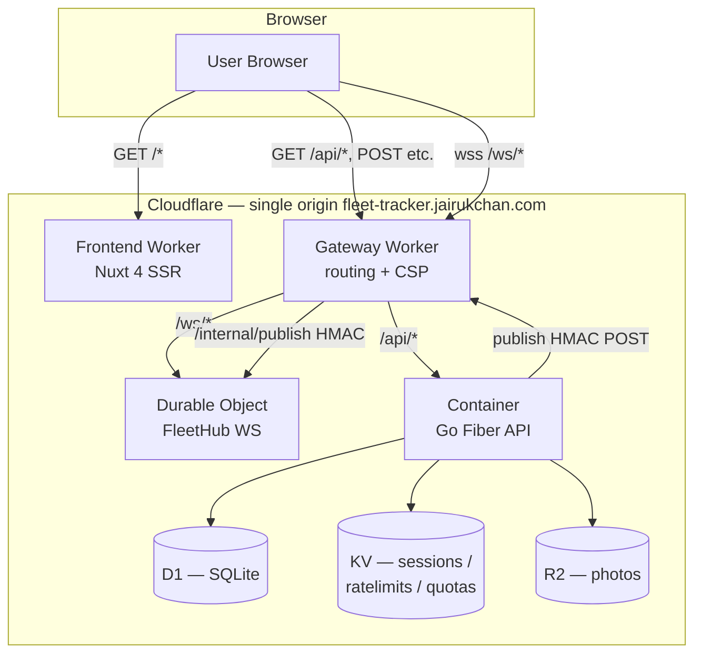

# Mini Fleet Tracker

Real-time fleet tracking demo in Go (Fiber) and Nuxt 4 on the Cloudflare edge.

> **Live demo at <https://fleet-tracker.jairukchan.com> runs until 2026-05-31.**
> After that, the demo URL serves an `/expired` page and the production Container is scaled to zero. The source below stays available — see [Demo lifecycle](#demo-lifecycle) for the revival story.

[](LICENSE)
[](backend/go.mod)
[](frontend/package.json)
[](frontend/nuxt.config.ts)
[](workers/wrangler.toml)

---

## Demo

Visit <https://fleet-tracker.jairukchan.com> and sign in with the seeded credentials:

- **Manager** — `manager@demo.local` / `SeedPassword!1`
- **Driver** — `driver@demo.local` / `SeedPassword!1`

These accounts are created by `make seed` (see [Quick start](#quick-start)) and are intentionally checked into source so a reviewer can sign in without a credentials handoff. Real production deployments would never do this.

The manager view shows the live fleet map and history; the driver view reports positions on demand. To see live updates without a phone, run the driver simulator (`make sim`).


<!-- TODO: capture and embed the dashboard GIF after the production deploy lands (TASK-026). -->

---

## Architecture



One hostname — `fleet-tracker.jairukchan.com` — fronts everything. The gateway Worker matches `/api/*` and `/ws/*` first; the frontend Worker catches everything else. That single-origin shape is the foundation for `SameSite=Lax` cookies, no CORS preflights, automatic cookie delivery on the WebSocket handshake, and a tight CSP. The deeper rationale lives in [ARCHITECTURE.md § Routing model](ARCHITECTURE.md#routing-model).

---

## Tech stack

**Backend — Go (production code path)**

- Go 1.25, Fiber v2
- Clean architecture: `domain → usecase → repository → cfclient`
- `golang-jwt/jwt/v5` (HS256 with `WithValidMethods` pin), `argon2id` per RFC 9106 (m=64 MB, t=3, p=2)
- `validator/v10`, `viper`, `zerolog` with request-scoped logger
- Multi-stage Dockerfile → distroless static, non-root

**TypeScript Workers — edge surface**

- Gateway Worker (`workers/gateway`) — path-based dispatch, CSP injection, demo-expiration short-circuit
- FleetHub Durable Object (`workers/fleet-hub`) — WebSocket Hibernation API, HMAC-verified publish endpoint, JWT-verified upgrade
- `vitest-pool-workers` for in-runtime tests

**Frontend — Nuxt 4 SSR**

- Nuxt 4 + Vue 3 + TypeScript strict
- `shadcn-vue` (`shadcn-nuxt` module), Tailwind v4, Pinia
- `vee-validate` + `zod` for form validation
- `maplibre-gl` + OpenFreeMap vector tiles (no API key, no rate limit)
- Native WebSocket via VueUse `useWebSocket`

**Cloudflare services**

- D1 (SQLite) — primary data store, accessed via the D1 HTTP `query` endpoint
- KV — JWT blocklist on logout, token-bucket rate limit state, R2 upload quotas
- R2 — vehicle photos, S3-signed PUT/GET via the SigV4 path
- Containers — host the Go Fiber binary
- Durable Objects — single-instance WebSocket hub (`global-fleet`)
- Workers — gateway + frontend SSR (Nitro `cloudflare_module` preset)

---

## API spec

All routes live under `https://fleet-tracker.jairukchan.com`. Mutating routes (POST, PATCH, PUT, DELETE) require the double-submit CSRF header `X-CSRF-Token` in addition to the auth cookie.

| Method | Path | Auth | Description |
|--------|------|------|-------------|
| POST | `/api/auth/register` | none | Create a driver or manager account |
| POST | `/api/auth/login` | none | Issue auth + CSRF cookies (HttpOnly, SameSite=Lax) |
| POST | `/api/auth/logout` | required | Clear cookies, blocklist the JTI in KV |
| GET | `/api/auth/me` | required | Return the current user |
| GET | `/api/vehicles` | manager | List vehicles |
| GET | `/api/vehicles/:id` | manager | Fetch one vehicle |
| POST | `/api/vehicles` | manager | Create a vehicle |
| PATCH | `/api/vehicles/:id` | manager | Update plate / model / driver assignment |
| DELETE | `/api/vehicles/:id` | manager | Delete a vehicle |
| POST | `/api/positions` | driver | Submit `lat`, `lng`, `speed_kmh`, `recorded_at` |
| GET | `/api/vehicles/:id/positions` | manager | History query: `from`, `to`, `limit` |
| GET | `/api/vehicles/:id/geofence` | manager | Read the circular geofence |
| PUT | `/api/vehicles/:id/geofence` | manager | Set the geofence (`center_lat`, `center_lng`, `radius_m`) |
| POST | `/api/vehicles/:id/photos:presign` | manager | Mint a presigned R2 PUT URL (quota-gated) |
| GET | `/api/vehicles/:id/photos` | manager | List photos with signed GET URLs |
| GET | `/healthz` | none | Liveness + dependency ping (D1, KV) |
| WS | `/ws/fleet` | manager | Receive `position.update` and `geofence.alert` |

Validation runs in both layers — `zod` schemas on the frontend, `validator/v10` on the backend. Errors come back as `{ code, message, details? }` with a stable `code` taxonomy (`unauthorized`, `forbidden`, `not_found`, `already_exists`, `validation`, `too_many`, `demo_expired`).

---

## Project structure

```text
mini-fleet-tracker/
├── backend/                       # Go Fiber API — runs in Cloudflare Containers
│   ├── cmd/
│   │   ├── api/                   # entry point + bootstrap (composition root)
│   │   ├── seed/                  # demo data seeding (idempotent)
│   │   └── sim/                   # driver simulator CLI (bonus 1)
│   ├── internal/
│   │   ├── config/                # viper-loaded env config
│   │   ├── domain/                # entities + sentinel errors
│   │   ├── handler/               # Fiber HTTP handlers
│   │   ├── middleware/            # auth, csrf, ratelimit (global + per-route), expiry
│   │   ├── publisher/             # HMAC POST to gateway /internal/publish
│   │   ├── repository/d1/         # SQL access via the Executor interface
│   │   └── usecase/               # business logic, validation, ownership checks
│   ├── pkg/
│   │   ├── cfclient/              # typed HTTP clients (D1, KV, R2, DO)
│   │   ├── geo/                   # Haversine + geofence math
│   │   ├── hash/                  # argon2id wrapper
│   │   └── jwt/                   # signer + verifier (HS256 pinned)
│   ├── migrations/                # SQL DDL embedded into the binary
│   ├── Dockerfile                 # multi-stage, distroless runtime
│   └── Makefile                   # dev, build, test, lint, sim, seed
├── workers/                       # Cloudflare TypeScript edge
│   ├── gateway/                   # routing + CSP + expiry short-circuit
│   ├── fleet-hub/                 # Durable Object: WebSocket hub
│   └── wrangler.toml              # bindings (D1, KV, R2, DO, Container)
├── frontend/                      # Nuxt 4 SSR — runs on Cloudflare Workers
│   └── app/                       # pages, components, composables, stores, middleware
├── docs/screenshots/              # README assets
├── ARCHITECTURE.md                # deeper design + trade-off notes
├── LICENSE                        # MIT
└── README.md                      # this file
```

---

## Quick start

Three steps for a local development loop:

```bash
# 1. Clone
git clone https://github.com/ilGentEAcutoO/mini-fleet-tracker.git
cd mini-fleet-tracker

# 2. Configure backend env (D1, KV, R2 ids + tokens, JWT secret, internal publish secret)
cp backend/.env.example backend/.env
$EDITOR backend/.env

# 3. Run the stack
make -C backend seed   # one-shot: creates manager + driver + 3 vehicles
make -C backend dev    # terminal 1: Go API on :8080

cd frontend && pnpm install && pnpm dev   # terminal 2: Nuxt SSR on :3000

cd workers && pnpm install && pnpm dev    # terminal 3 (optional): gateway + DO on :8787
```

To exercise the live-tracking path without a phone, run the bundled simulator in a fourth terminal:

```bash
make -C backend sim ARGS="\
  --email driver@demo.local \
  --password SeedPassword!1 \
  --vehicle-id <DEMO-001-uuid> \
  --base-url http://localhost:8080 \
  --interval 2s"
```

The simulator logs in, then walks a random track seeded around Bangkok (lat 13.7563, lng 100.5018), POST-ing one position every interval. The manager dashboard should show the marker move within ~2 seconds end-to-end.

---

## Testing

| Stack | Command | What runs |
|-------|---------|-----------|
| Go API | `make -C backend test` | Race-enabled `go test ./...` with coverage |
| Workers | `cd workers && pnpm test` | `vitest-pool-workers` for gateway + DO |
| Frontend | `cd frontend && pnpm typecheck` | `nuxt typecheck` (strict) |
| Lint (Go) | `make -C backend lint` | `golangci-lint run` |

Backend tests are table-driven and use an in-memory `mattn/go-sqlite3` double behind the consumer-defined `Executor` interface, so the repository layer is exercised against a real SQL engine without HTTP round-trips. The Workers tests run inside the `workerd` runtime via `@cloudflare/vitest-pool-workers`, so route matching, WebSocket upgrades, and the Durable Object hibernation path are exercised against the real CF primitives rather than mocks. See [ARCHITECTURE.md § Testing strategy](ARCHITECTURE.md#testing-strategy) for the full layering and where each pattern lives.

---

## Demo lifecycle

The live demo has a **hard expiration on 2026-05-31T23:59:59+07:00**. After that timestamp:

- The backend returns `410 Gone` from every route except `/healthz`, with `{ "code": "demo_expired", "repo_url": "..." }`
- The gateway Worker short-circuits `/api/*` and `/ws/*` to 410 before they reach the Container — saving wake-ups
- The FleetHub Durable Object rejects new WebSocket upgrades
- The frontend auto-redirects to `/expired` when the API returns 410
- On 2026-06-01 the Container is manually scaled to zero instances via `wrangler deploy --container instances=0`, dropping the running cost line to $0

The cut-off is baked in as a `const` at three layers (Go, gateway, DO) on purpose. Reviving the demo requires a deliberate five-step source edit + rebuild + redeploy — not a dashboard toggle. The full procedure is documented in [ARCHITECTURE.md § Demo revival workflow](ARCHITECTURE.md#demo-revival-workflow).

This is the cost-protection story the architecture is built around. Total spend for the public demo window is capped under $5.

---

## Architecture decisions

The interesting trade-offs — Cloudflare Containers vs free-tier hosts, D1 vs Postgres, Durable Objects vs Redis pub/sub, Nuxt 4 vs plain Vue — are documented honestly in [ARCHITECTURE.md § Trade-offs](ARCHITECTURE.md#trade-offs). The summary: this demo optimises for "all-Cloudflare ecosystem story" with the data-layer cost of HTTP clients instead of `pgx`, and compensates by keeping the Go production code (clean architecture, middleware stack, graceful shutdown, table-driven tests) deliberately conventional so the swap to `pgx` would be a same-day change.

---

## License

MIT © 2026 ilGentEAcutoO. See [LICENSE](LICENSE).

The seeded credentials in [Demo](#demo) and the local-only secrets in `backend/.env.example` are placeholders by design. Never commit a real `.env` — the `.gitignore` blocks it from the first commit, but a final secret-scan (`git log --all -p | grep -iE "(secret|password|api.?key|token)"`) is part of the pre-public checklist regardless.

---

## Author

Built by **[ilGentEAcutoO](https://github.com/ilGentEAcutoO)** for the Zero Friction Fullstack Developer application — a portfolio piece optimised for the Go signal in a Vue-strong stack.
